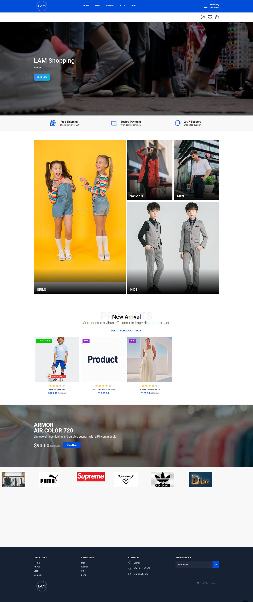
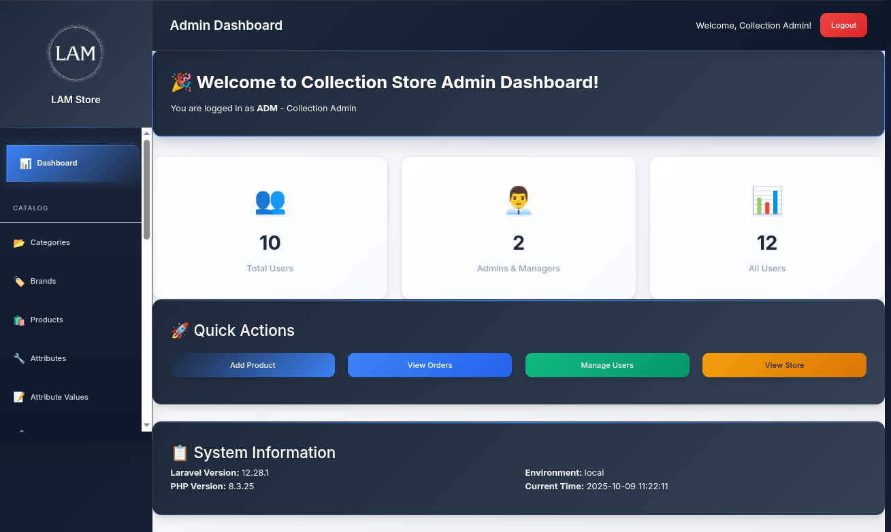
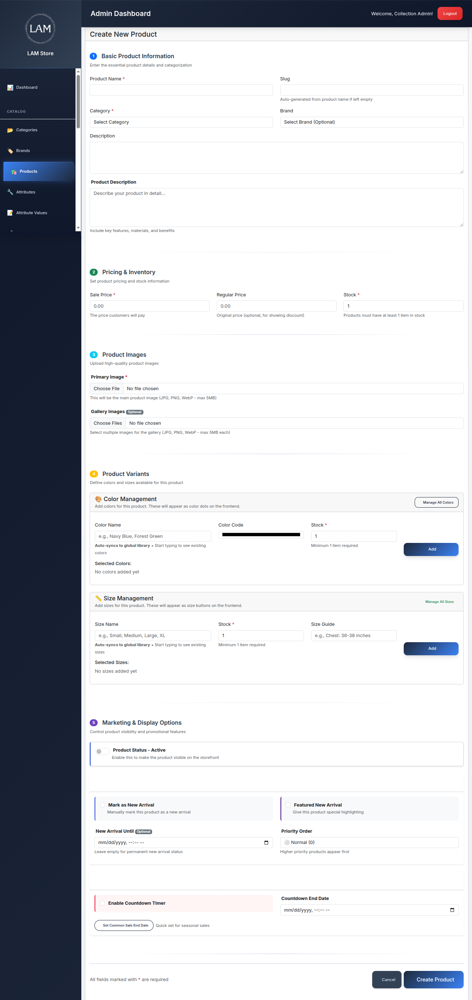

  

  
  
  

# E-Commerce Dashboard Project

This project is a full **e-Commerce platform** built with **Laravel**, including a **frontend shopping interface** and a **powerful admin dashboard**. The dashboard allows full control of the store's content and settings.

## Features

### Frontend
- Interactive shopping experience with **product listings** and **categories**: Women, Men, Girl, Boy.
- Dynamic **header** with category navigation.
- Add products to **cart** and view **order items**.
- Fully customizable **Hero Section** and **Footer**, managed via the dashboard.

### Admin Dashboard
- **Product Management**: Create, update, delete products.
- **Category Management**: Create, update, delete categories.
- **Brand Management**: Create, update, delete brands.
- **Orders & Order Items**: View all orders and order details.
- **Settings & Permissions**:
  - Manage **admin roles** and **user permissions** (Role-Based Access Control).
  - Change **Header**, **Hero Section**, and **Footer** dynamically.
  - Control what users and admins can view or edit.

### User Management
- Assign roles to admins or staff.
- Define permissions for CRUD operations on products, categories, and settings.
- Secure access to sensitive features based on roles.

## Screenshots

  
*Frontend shopping interface with dynamic categories and cart*
  
*Admin Dashboard with products, categories, and settings*
  
*Admin Dashboard with products, categories, and settings*

## Technologies Used

- **Laravel** - PHP Framework
- **Blade** - Templating engine
- **MySQL** - Database
- **Bootstrap** - Frontend styling
- **JavaScript** - Interactive frontend features

